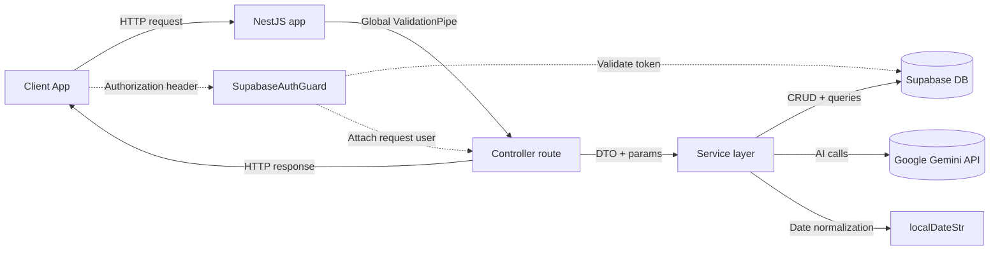
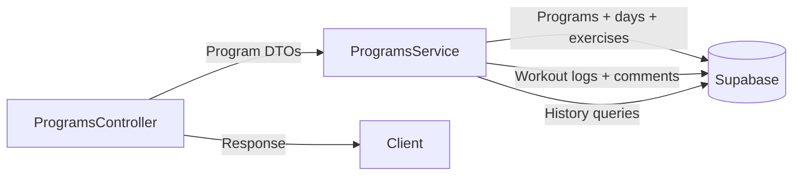
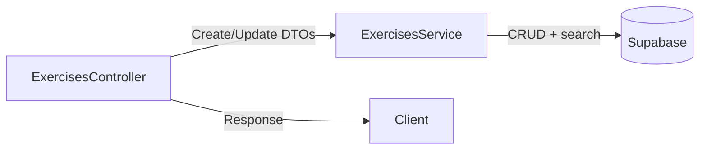
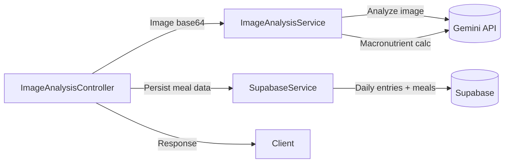
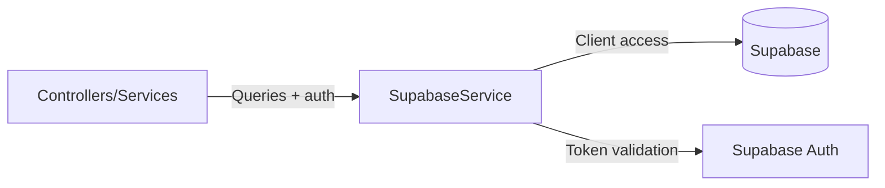
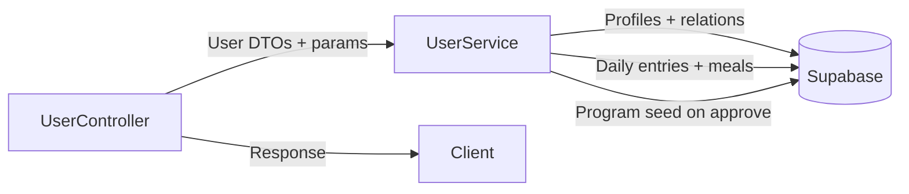
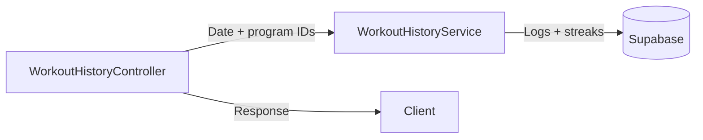

# Backend Workflow Overview

This document summarizes the current request workflow in the NestJS backend and the main module integrations.

## High-Level Flow

- Requests enter the NestJS app created in [src/main.ts](src/main.ts) with global `ValidationPipe`, JSON body limits, and CORS enabled.
- Routing is handled by module controllers (e.g., programs, exercises, image-analysis, user, workoutHistory).
- Controllers delegate to services, which encapsulate business logic and external calls.
- Most persistence and reads go through Supabase via `SupabaseService`.
- Image analysis uses the Google Gemini API and optionally persists results to Supabase.
- Utilities like `localDateStr` from [utils/getLocalTime.ts](utils/getLocalTime.ts) normalize dates for queries.
- A Supabase JWT auth guard exists in [utils/AuthGuard.ts](utils/AuthGuard.ts) but is currently commented out in controllers.

## Mermaid Flowchart

## Service Details (Current)

## Per-Service Mini-Flows

### ProgramsService

### ExercisesService

### ImageAnalysisService

### SupabaseService

### UserService

### WorkoutHistoryService

### `ProgramsService`

- Creates full user programs with nested days/exercises; rolls back the program if day/exercise inserts fail.
- Reads a program with nested days, assigned exercises, and exercise metadata in a single query.
- Updates/deletes programs and days; adds, bulk adds, updates, and removes assigned exercises.
- Logs workouts and sets; completes workouts and returns history with optional limits.
- Adds workout comments tied to workout logs and users.

### `ExercisesService`

- Creates, reads, updates, deletes exercise records in Supabase.
- Supports optional muscle group filtering, full-text name search, and unique muscle group lists.

### `ImageAnalysisService`

- Calls Google Gemini for image-to-JSON food analysis with a strict response schema.
- Calls Google Gemini again to estimate macronutrients for provided food items.
- Returns JSON strings that the controller parses or forwards to Supabase persistence.

### `SupabaseService`

- Creates the Supabase client using environment variables.
- Validates user tokens and exposes helpers for raw queries.
- Persists meal, daily entry, and ingredient data from image analysis workflows.

### `UserService`

- Fetches user lists by coach, resolves user details and coach relations.
- Reads daily entries and meals for a given date; returns sensible defaults if not found.
- Updates user fitness macros and assigns users to coaches by coach code.
- Approves or rejects coach-user relations and seeds a starter program on approval.

### `WorkoutHistoryService`

- Reads month history for a program, using date range queries.
- Fetches workout streaks per user and exercise logs for a workout day.
